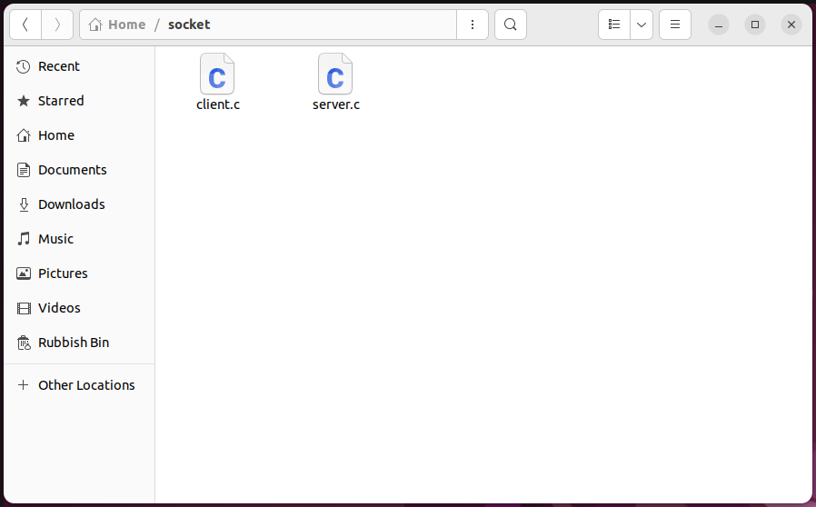

# KONSEP JARINGAN

## Socket

### 1. Pengertian Socket
Socket adalah abstraksi perangkat lunak yang digunakan dalam pemrograman jaringan untuk mengatur komunikasi data antara dua komputer atau perangkat melalui jaringan. Socket bekerja seperti "alat" yang memungkinkan aplikasi atau program di satu komputer berbicara dengan aplikasi atau program di komputer lain. Berikut beberapa poin kunci terkait dengan pengertian socket:
- **Titik Akhir Komunikasi**: Socket adalah titik akhir atau endpoint dalam proses komunikasi data. Setiap socket memiliki dua komponen utama, yaitu alamat IP dan nomor port.
- **Alamat IP**: Alamat IP adalah alamat unik yang digunakan untuk mengidentifikasi komputer atau perangkat di jaringan. Ini mirip dengan alamat rumah Anda di dunia nyata dan diperlukan untuk mengirim data ke komputer yang tepat.
- **Nomor Port**: Nomor port adalah angka yang digunakan untuk mengidentifikasi layanan atau aplikasi tertentu yang berjalan di komputer tersebut. Port membantu sistem operasi mengarahkan data ke aplikasi yang benar. Contohnya, port 80 biasanya digunakan untuk layanan web (HTTP).

### 2. Jenis Socket
#### a. Socket Client:
- Socket client adalah komponen perangkat lunak yang berfungsi sebagai inisiasi dalam komunikasi jaringan.
- Socket client dapat menghubungkan ke satu atau lebih socket server, bergantung pada kebutuhan aplikasi.
- Tugas utama socket client adalah untuk meminta layanan atau data dari socket server.
#### b. Socket Server:
- Socket server adalah komponen perangkat lunak yang berfungsi untuk menerima permintaan dari socket client dan memberikan respons sesuai dengan permintaan tersebut.
- Socket server berjalan secara terus-menerus, mendengarkan permintaan yang masuk dari berbagai socket client yang ingin berkomunikasi.
- Tugas utama socket server adalah untuk merespons permintaan dari client, seperti mengirim data atau menjalankan tugas tertentu berdasarkan permintaan tersebut.

### 3. Proses Socket

1. Pertama buka terminal yang ada pada Linux
2. Siapkan file client dan Server
   - [client.c](link_ke_client.c)
   - [server.c](link_ke_server.c)
4. Masuk ke halaman yang ada server.c
5. Ketik ``gcc -o server server.c`` untuk mengompilasi Server dalam bahasa C
6. Ketik ``./server`` untuk menjalankan program yang telah dikompilasi
7. Buka terminal baru dan masuk ke halaman yang ada client.c
4. Ketik ``gcc -o client client.c`` untuk mengompilasi Client dalam bahasa C
5. Ketik ``./client`` untuk menjalankan program yang telah dikompilasi
6. Ketikkan sesuatu di client misalnya LOGIN, maka akan muncul pesan LOGIN pada server
 

  
<strong>Gambar:</strong> Terminal pada Client
 

 

  
<strong>Gambar:</strong> Terminal pada Server
 

***
