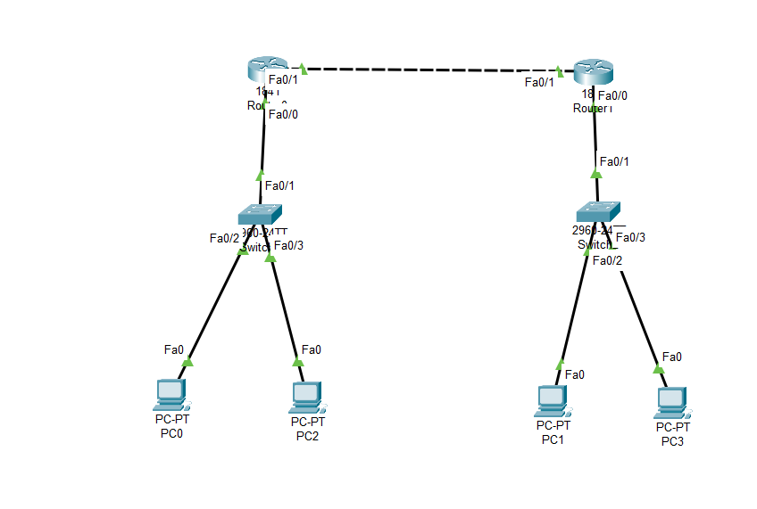
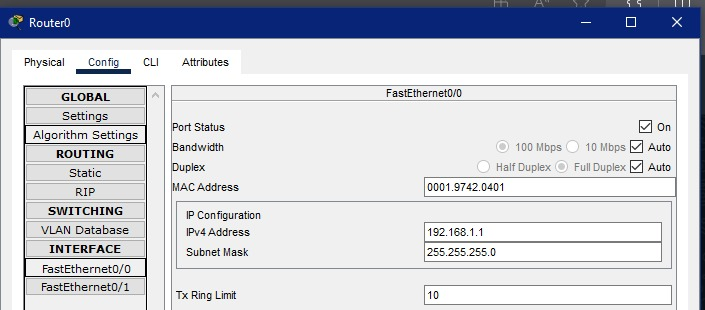
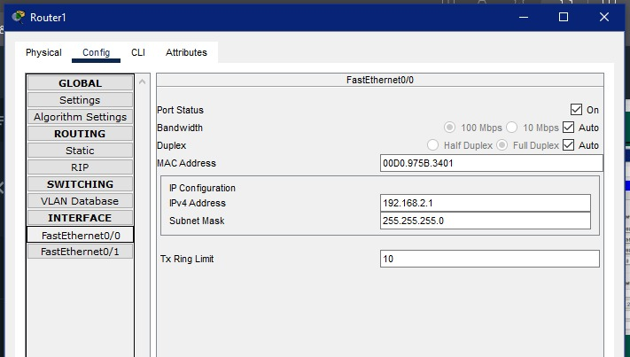
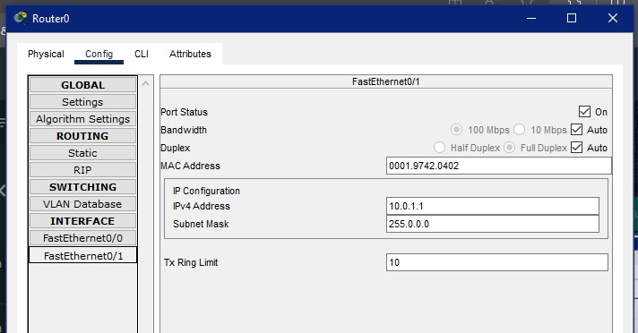
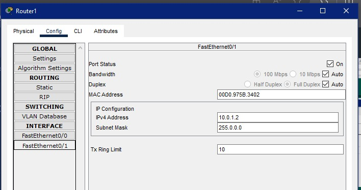
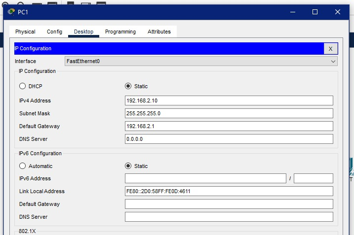
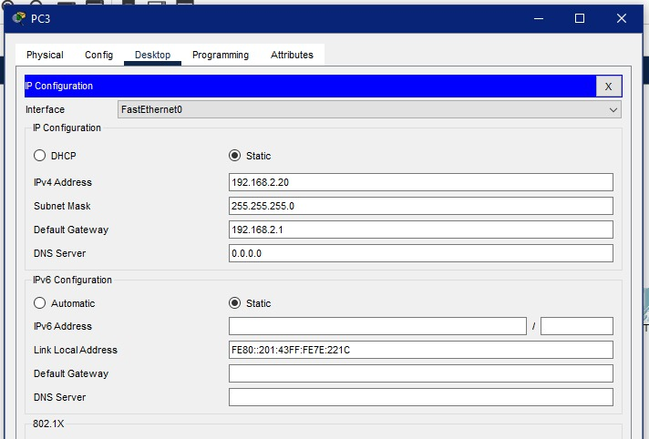
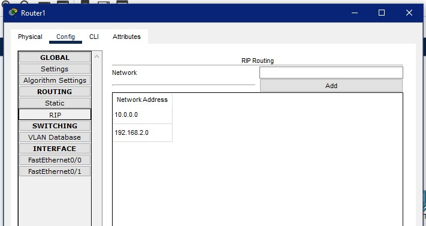

<h1> KONSEP JARINGAN </h1>

    Nama           : Saiq Syahru Qadri
    NRP            : 3122600029
    Kelas          : 2 - D4 Teknik Informatika A
    Mata Kuliah    : Konsep Jaringan
    Dosen Pengampu : Dr. Ferry Astika Saputra ST, M.Sc

---

## Cisco Packet Tracer

**Gambar**: Cisco Packet Tracer

Sebuah topologi jaringan yang telah dirancang dan dikonfigurasi dalam lingkungan simulasi menggunakan Cisco Packet Tracer. Topologi jaringan adalah susunan fisik dan logis dari perangkat jaringan yang terinterkoneksi, yang berfungsi sebagai kerangka kerja untuk pertukaran data dan sumber daya di dalam jaringan. Dalam konteks ini, kita akan menjelajahi implementasi konkret dari topologi yang melibatkan dua router, dua switch, dan empat komputer (PC).

Router adalah komponen kunci yang menghubungkan berbagai subnet di jaringan, sementara switch berperan penting dalam mengarahkan lalu lintas data antar perangkat dalam subnet yang sama. Sedangkan, komputer (PC) berfungsi sebagai entitas pengguna akhir yang memerlukan konfigurasi yang tepat untuk berkomunikasi dengan perangkat di luar subnet mereka. Dalam laporan ini, kami akan memberikan panduan rinci tentang konfigurasi setiap perangkat, termasuk penyetelan alamat IP, pengaturan routing, serta uji coba efektivitas komunikasi antara PC dan router. Selain itu, kami juga akan membahas implikasi praktis dari topologi jaringan ini dalam konteks pengelolaan jaringan yang lebih luas.

Untuk membuat jaringan ini berfungsi, Anda perlu mengkonfigurasi router dan switch dengan benar. Berikut adalah beberapa langkah rinci:

**Gambar**: Fast Ethernet 0 Router 0

**Gambar**: Fast Ethernet 0 Router 1

#### Router 0 (R0):
- Interface FastEthernet 0/0 terhubung ke Switch 0. Anda perlu mengatur alamat IP pada antarmuka ini sebagai gateway untuk subnet 192.168.1.0/24. Misalnya: ip address 192.168.1.1 255.255.255.0.
- Interface FastEthernet 0/1 terhubung ke Router 1. Anda perlu mengatur alamat IP pada antarmuka ini dalam subnet yang sama dengan Router 1, yaitu 10.0.1.0/24. Misalnya: ip address 10.0.1.1 255.255.255.0.
- Aktifkan routing di Router 0 dengan perintah ip routing.

**Gambar**: Fast Ethernet 1 Router 0

**Gambar**: Fast Ethernet 1 Router 1

#### Router 1 (R1):
- Interface FastEthernet 0/0 terhubung ke Switch 1. Anda perlu mengatur alamat IP pada antarmuka ini sebagai gateway untuk subnet 192.168.2.0/24. Misalnya: `ip address 192.168.2.1 255.255.255.0`.
- Interface FastEthernet 0/1 terhubung ke Router 0. Anda perlu mengatur alamat IP pada antarmuka ini dalam subnet yang sama dengan Router 0, yaitu 10.0.1.0/24. Misalnya: `ip address 10.0.1.2 255.255.255.0`.
- Aktifkan routing di Router 1 dengan perintah `ip routing`.

#### Switch 0 (S0):
- Tidak perlu konfigurasi khusus pada switch. Switch akan memahami lalu lintas berdasarkan alamat MAC perangkat yang terhubung.

#### Switch 1 (S1):
- Tidak perlu konfigurasi khusus pada switch ini juga.

**Gambar**: IP Config pc 0

**Gambar**: IP Config pc 1

**Gambar**: IP Config pc 2

**Gambar**: IP Config pc 3

#### PC-0, PC-2, PC-1, PC-3:
- Setiap PC harus memiliki gateway yang sesuai. PC-0 dan PC-2 harus memiliki gateway 192.168.1.1, sedangkan PC-1 dan PC-3 harus memiliki gateway 192.168.2.1.

Dengan konfigurasi ini, PC-0 dan PC-2 akan dapat berkomunikasi satu sama lain melalui Switch 0 dan Router 0, sedangkan PC-1 dan PC-3 akan dapat berkomunikasi satu sama lain melalui Switch 1 dan Router 1. Router 0 dan Router 1 akan bertindak sebagai penghubung antara dua subnet yang berbeda. Pastikan juga untuk mengatur DNS atau entri HOSTS yang sesuai pada setiap PC untuk melakukan komunikasi dengan nama alamat.

Namun terdapat error seperti Unreachable IP yang tidak memungkinkan untuk PC-0 dan PC-1 terhubung. Untuk memperbaiki hal tersebut adalah dengan cara mengisi RIP yang ada di dalam router.

**Gambar**: RIP Router 0

**Gambar**: RIP Router 1

***
